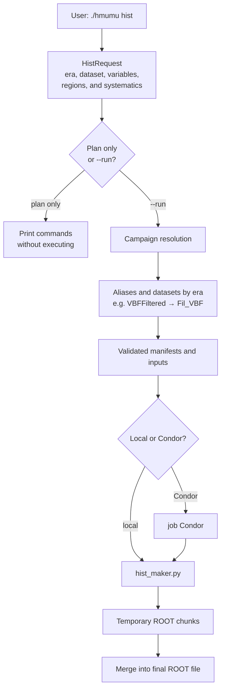
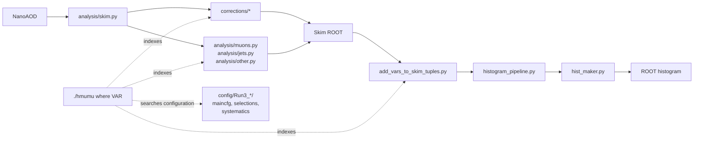

# H→μμ analysis framework

Use the unified `hmumu` interface for day-to-day work. For example:

```bash
# One histogram: first show the plan, then add --run
./hmumu hist -e 2025 -d DYto2Mu_MLL_105to160_amcatnloFXFX \
  -v m_mumu -r Signal_Fit -c VBF

# Where is a variable computed?
./hmumu where m_mumu

# Which columns are defined in the framework?
./hmumu vars weight
```

The quick guide is in
[docs/SIMPLE_WORKFLOW.md](docs/SIMPLE_WORKFLOW.md); the component map and
technical-debt overview are in
[docs/FRAMEWORK_ARCHITECTURE.md](docs/FRAMEWORK_ARCHITECTURE.md).

## What has become simpler

Previously, histogram production required knowing all of the following:

- which wrapper to use, `hists.sh` or `systematics.sh`;
- which options belonged to the campaign and which to `hist_maker.py`;
- where to place the `--` separator;
- the input, manifest, and reweighting JSON paths;
- dataset-group names and the differences between Central and shifted systematics;
- the Bash loops needed to combine eras and systematics.

These decisions are now handled by the single public `hmumu` command:

| Operation | Command |
|---|---|
| One histogram | `./hmumu hist -e 2025 -d DATASET -v m_mumu -r Signal_Fit -c VBF` |
| Execute the plan | add `--run` |
| Use Condor | add `--condor` |
| Multiple eras | `-e 2022,2022EE,2023,2023BPix,2024,2025` |
| Multiple systematics | `-s Central,JERC,ScaRe,Muon,PU,QCDScale,PDF` |
| Hadd 2022+2023 | `./hmumu merge-eras /path/Hists_Central` |
| Datasets → processes | `./hmumu hadd-processes /path/Hists_Central -e 2023BPix` |
| Central + shifted | `./hmumu merge-systematics /path/Hists_Central` |
| Find a variable | `./hmumu where NAME` |
| List columns | `./hmumu vars [FILTER]` |
| Check the setup | `./hmumu doctor` |
| DY hard/PU components | `./hmumu hist ... --dy-jet-components` |
| Test on one file | `./hmumu hist ... --one-file --run` |

Without `--run`, `hmumu hist` only prints the plan. This lets you inspect the
datasets, outputs, and options before starting a production.

To inspect an existing production, use the same arguments with `--check`. The
command lists complete and missing outputs, jobs that are already queued, and
`*_tmp` directories without submitting anything:

```bash
./hmumu hist -e 2023 -s Central,JERC -v DNN_NNOutput \
  -r Signal_Fit,Z_sideband,H_sideband -c VBF \
  --output-base /eos/user/v/vdamante/H_mumu/campaigns/DNN \
  --condor --check
```

When `--check` is replaced with `--run`, `--missing-only` resubmits only
missing outputs; valid outputs and jobs already in the queue are skipped.

For a quick test on the first valid file:

```bash
./hmumu hist -e 2025 -d DATASET -v m_mumu -r Z_sideband -c ggF \
  --one-file --run
```

Tests limited with `--one-file` or `--max-files N` are written to
`/tmp/vdamante/hmumu_tests` by default, not to official production directories.

Failed chunks are handled automatically: serial MC jobs (`--n-cores 1`) exclude
the failed chunk, recompute denominators from the remaining JSON reports, and
reprocess the surviving chunks. Data and parallel MC jobs remain fail-fast.
`--no-skip-failed-chunks` also forces fail-fast behavior for MC.

Merge commands also show the plan first and require `--run` to execute:

```bash
# Create Hists_Central/Run3_2022_23 from the four 2022/2023 periods.
./hmumu merge-eras /eos/user/v/vdamante/H_mumu/Hists_Central
./hmumu merge-eras /eos/user/v/vdamante/H_mumu/Hists_Central --run

# Read the sibling directories Hists_Central, Hists_JERC, Hists_Muon,
# Hists_PDF, Hists_PU, Hists_QCDScale, and Hists_ScaRe.
# The default output is Hists_merged.
./hmumu merge-systematics /eos/user/v/vdamante/H_mumu/Hists_Central
./hmumu merge-systematics /eos/user/v/vdamante/H_mumu/Hists_Central --run

# Limit the merge to one era:
./hmumu merge-systematics /eos/user/v/vdamante/H_mumu/Hists_Central \
  -e 2022 --run
```

Both commands automatically discover all `.root` files, preserve any
subdirectories, and include a file even when it is not present in every input
(the typical case is data that exist only in `Central`). Temporary `*_tmp`
directories and their chunks are ignored.

A ready-to-customize file covering Central, shifted systematics, and merging is
available at [`examples/run_histograms.sh`](examples/run_histograms.sh). For
example:

```bash
bash examples/run_histograms.sh plan-all
bash examples/run_histograms.sh run-all
```

The complete driver for DNN, jet-component, and plain campaigns across all eras
through the final merges is
[`campaigns/run3_histogram_workflows.sh`](campaigns/run3_histogram_workflows.sh).
Running it without arguments prints the interface and an end-to-end example.

### Example: one histogram

```bash
./hmumu hist \
  -e 2025 \
  -d DYto2Mu_MLL_105to160_amcatnloFXFX \
  -v m_mumu \
  -r Signal_Fit \
  -c VBF
```

After checking the printed command:

```bash
./hmumu hist \
  -e 2025 \
  -d DYto2Mu_MLL_105to160_amcatnloFXFX \
  -v m_mumu \
  -r Signal_Fit \
  -c VBF \
  --run
```

Advanced options remain available without complicating the common case:

```bash
./hmumu hist -e 2025 -d DATASET -v m_mumu \
  --run -- --no-skip-failed-chunks
```

### Histogram workflow diagram



The internal layers remain for compatibility, but users no longer need to
compose them manually. `hmumu` selects the correct wrapper, places options on
the appropriate sides of `--`, applies defaults, and resolves dataset aliases.

## Tracing how a variable is computed

A simple text search was not sufficient because many columns are defined across
multiple lines or built with f-strings. The `common/variable_catalog.py`
catalog analyzes Python `Define` and `Redefine` calls and links each column name
to the function that produces it.

```bash
./hmumu where m_mumu
```

The output is organized into:

1. `DEFINITIONS`: file, line, and producer function;
2. `expression`: expression passed to `RDataFrame.Define`;
3. `known inputs`: other columns recognized in the expression;
4. `CONFIGURATION`: uses in YAML/TOML files;
5. `REFERENCE`: other uses in the code.

To explore the available columns:

```bash
./hmumu vars
./hmumu vars weight
./hmumu vars mu --dynamic
```

`--dynamic` also includes generated-name templates such as `mu{...}_pt`.

## DY hard/PU components

For the dedicated jet-response fit:

```bash
./hmumu hist \
  -e 2025 \
  --datasets DY_amcatnlo,DY_amcatnlo_105_160 \
  -r Z_sideband \
  --dy-jet-components
```

This mode divides events into `0J`, `1J Hard/PU`, `2J Hard/PU1/PU2`, and
`VBF Hard/PU1/PU2`. It produces `m_mumu` in 0J, `eta(j1):pT(j1)` in 1J, and
`eta(j2):pT(j2)` in ≥2J. VBF matching uses the two actual VBF indices.
Each component is written to a separate `*_DY_*.root` file, while the original
dataset filename remains the inclusive DY output. VBF directories contain the
subdirectories `incl`, `CC`, `CF`, and `FF`, where a central jet has
`|eta| < 2.5` and a forward jet has `|eta| >= 2.5`.

A jet with `genJetIdx >= 0` is hard; a jet without an associated gen jet is PU.
This mode requires regenerated DY skims containing `Jet_genJetIdx`: the
currently verified 2025 `skim_v2` files do not yet contain this branch.
Details and complete component names are in the
[quick guide](docs/SIMPLE_WORKFLOW.md#componenti-dy-hardpu-per-il-fit-dei-jet).

### Variable-path diagram



## What has not been hidden

`dataset_campaign.sh` and `hist_maker.py` are still large backends because they
contain logic already used in production. They have been placed behind
`hmumu`, not rewritten in a single pass: splitting them further requires
numerical comparisons of ROOT outputs to ensure that the physics does not
change.

For new code, the rule is:

- user interaction belongs in `hmumu`;
- declarative configuration belongs in `config/`;
- dataframe transformations belong in small, named functions;
- local/Condor orchestration is shared;
- do not add new Bash wrappers for ordinary use cases.

The following sections document the low-level backends. They are useful for
debugging and development, but they are not the recommended interface for new
productions.

## Running Guide: Skim, Histograms, Hadd, Plots

This is the low-level end-to-end running guide for the framework: local tests,
skim campaigns, histogram campaigns, hadd, and plotting.

## Setup

Start from the repository root:

```bash
cd Hmm_newSkim
source env.sh
```

For EOS/XRootD access, make sure you have a valid CMS proxy:

```bash
voms-proxy-init --rfc --voms cms -valid 192:00
voms-proxy-info
```

Condor jobs source `env.sh` inside the worker executable, so the submit shell does not need to carry the full runtime environment.

## Main Scripts

### Skim: `analysis/skim.py`

Produces one skim ROOT file from one NanoAOD input file.

```bash
python3 analysis/skim.py \
  --era Run3_2024 \
  --dataset-name DYto2Mu_MLL_105to160_amcatnloFXFX_Fil_VBF \
  --input-file /eos/cms/store/mc/.../INPUT.root \
  --output-file /tmp/vdamante/test_skim.root \
  --want-variations
```

Required options:

```text
--era
--dataset-name
--input-file
--output-file
```

Use `--want-variations` for MC systematic variations. It has no effect for data.

### Histograms: `histograms/hist_maker.py`

Produces one histogram ROOT file from a skim directory or a skim ROOT file.

```bash
python3 histograms/hist_maker.py \
  --era Run3_2024 \
  --dataset-name DYto2Mu_M_50_amcatnloFXFX \
  --input /eos/cms/store/group/phys_higgs/cmshmm/vdamante/skim_v2/Run3_2024/DYto2Mu_M_50_amcatnloFXFX/ \
  --output-file /tmp/vdamante/DYto2Mu_M_50_amcatnloFXFX.root \
  --variables DNN_NNOutput \
  --mass-regions Z_sideband \
  --categories baseline ggF VBF \
  --skip-file-validation
```

Required options:

```text
--era
--dataset-name
--input
--output-file
```

Common options:

```text
--variables VAR [VAR ...]
--mass-regions REGION [REGION ...]
--categories CATEGORY [CATEGORY ...]
--systematics central|all
--chunk-size N
--n-cores N
--skip-file-validation
--additional-cuts "CUT"
--shift-z-sideband-dnn-mass
```

Defaults:

```text
--systematics central
--chunk-size 6
--n-cores 4
--mass-regions mass_inclusive Z_sideband Signal_Fit
--categories baseline ggF VBF
```

### Plotting: `histograms/hist_plotter.py`

Reads hadded ROOT files and makes plots.

```bash
python3 histograms/hist_plotter.py \
  --era Run3_2024 \
  --input /eos/user/v/vdamante/H_mumu/newHists_Run3_2024_hadded/ \
  --output plots_DYamcatnlo/ \
  --region Z_sideband_ggF \
  --samples Data_Muon DY_amcatnlo EWK SingleTop TTX W DiTriBoson GluGluHto2Mu VBFHto2Mu_M125_powheg \
  --vars m_mumu,DNN_NNOutput \
  --wantData \
  --wantLogY \
  --rebin
```

Useful options:

```text
--region REGION_CATEGORY
--samples SAMPLE_OR_GROUP [SAMPLE_OR_GROUP ...]
--vars VAR1,VAR2
--wantData
--wantLogY
--rebin
--systematics
--no-stack
--no-fill-hists
--ratio-reference SAMPLE_OR_GROUP
--normalize-dy-to-data
--normalize-mc-to-data
```

`--samples` can be ROOT filenames without `.root`, process names from `config/<ERA>/process_names.yaml`, or groups from `config/plot/process_groups.yaml`.

## Skim Campaigns

Check missing skim outputs:

```bash
python3 htcondor/check_missing_files.py -e Run3_2024 --only-missing
```

Dry-run skim submission:

```bash
python3 htcondor/condorsubmit.py -e Run3_2024 --no-submit
```

Submit one era:

```bash
python3 htcondor/condorsubmit.py \
  -e Run3_2024 \
  --max-parallel-jobs 5000 \
  --poll-interval 120
```

Main skim outputs:

```text
/eos/cms/store/group/phys_higgs/cmshmm/vdamante/skim_v2/<ERA>/<DATASET>/
```

## Histogram Campaigns

The canonical local and Condor entry points are:

```bash
bash histograms/scripts/hists.sh --era Run3_2024 ...
python3 htcondor/histogram_condorsubmit.py --era Run3_2024 ...
```

Dataset selection, retries, throttling, and local/Condor execution share one
implementation.

Submit one group:

```bash
python3 htcondor/histogram_condorsubmit.py \
  --era Run3_2024 \
  --datasets DY_amcatnlo \
  --input-folder /path/to/manifests \
  --root-input-folder skim_v2 \
  --json-input-folder skim_v2 \
  --output-dir /path/to/hists \
  --missing-only \
  --max-parallel-jobs 5000 \
  -- --variables DNN_NNOutput
```

See [WORKFLOW.md](WORKFLOW.md) for the full validation, central histogram, and
shifted histogram campaigns. For the standard Run3 2024 central plus shifted
Condor submissions:

```bash
bash histograms/scripts/submit_2024_histograms_condor.sh --dry-run
```

Common groups:

```text
data
DiTriBoson
DY_amcatnlo
DY_amcatnlo_105_160
DY_amcatnlo_105_160_stitched
DY_amcatnlo_105_160_VBFFil
DY_minnlo
EWK
signals
other_signals
SingleH
SingleTop
TTX
W
```

Histogram outputs:

```text
/eos/user/v/vdamante/H_mumu/newHists_<ERA><SUFFIX>/
```

## Hadd

Merge per-dataset histograms into physics-process files:

```bash
era=Run3_2024

python3 histograms/hadd_hists_to_processes.py \
  --input-dir /eos/user/v/vdamante/H_mumu/newHists_${era}/ \
  --output-dir /eos/user/v/vdamante/H_mumu/newHists_${era}_hadded/ \
  --era ${era}
```

Dry-run:

```bash
python3 histograms/hadd_hists_to_processes.py \
  --input-dir /eos/user/v/vdamante/H_mumu/newHists_Run3_2024/ \
  --output-dir /eos/user/v/vdamante/H_mumu/newHists_Run3_2024_hadded/ \
  --era Run3_2024 \
  --dryRun
```

## DY MLL 105-160 Special Outputs

For 2024, 2025, and 2026:

```text
DY_amcatnlo_105_160           -> nonStitched outputs
DY_amcatnlo_105_160_stitched  -> GenVBFFilter==0, suffix _stitched
DY_amcatnlo_105_160_VBFFil    -> GenVBFFilter==1, suffix _stitched
```

Produce the pieces:

```bash
python3 htcondor/histogram_condorsubmit.py \
  --era Run3_2024 \
  --datasets DY_amcatnlo_105_160,DY_amcatnlo_105_160_stitched,DY_amcatnlo_105_160_VBFFil \
  --condor \
  --missing-only \
  --max-parallel-jobs 5000 \
  --output-suffix TT \
  -- --skip-file-validation
```

Copy special files into the hadded directory with plotter-friendly names:

```bash
era=Run3_2024
suffix=TT
input_dir=/eos/user/v/vdamante/H_mumu/newHists_${era}${suffix}
hadded_dir=/eos/user/v/vdamante/H_mumu/newHists_${era}${suffix}_hadded

cp ${input_dir}/DYto2Mu_MLL_105to160_amcatnloFXFX_stitched.root \
   ${hadded_dir}/DYto2Mu_MLL105To160.root

cp ${input_dir}/DYto2Mu_MLL_105to160_amcatnloFXFX_nonStitched.root \
   ${hadded_dir}/DYto2Mu_MLL105To160_nonStitched.root

cp ${input_dir}/DYto2Mu_MLL_105to160_amcatnloFXFX_Flashsim_nonStitched.root \
   ${hadded_dir}/DYto2Mu_MLL105To160_Flashsim.root

cp ${input_dir}/DYto2Mu_MLL_105to160_amcatnloFXFX_Fil_VBF_stitched.root \
   ${hadded_dir}/DYto2Mu_MLL105To160_VBFFiltered.root
```

## Useful Recipes

Z-sideband shifted DNN:

```bash
python3 htcondor/histogram_condorsubmit.py \
  --era Run3_2022EE \
  --datasets signals \
  --condor \
  --missing-only \
  --output-suffix _ZSideband_mass_shifted \
  -- \
  --variables DNN_NNOutput \
  --mass-regions Z_sideband \
  --shift-z-sideband-dnn-mass \
  --skip-file-validation
```

Low-pT/TT categories:

```bash
python3 htcondor/histogram_condorsubmit.py \
  --era Run3_2024 \
  --datasets signals \
  --condor \
  --missing-only \
  --output-suffix TT \
  -- \
  --categories baseline_lowPtTT ggF_lowPtTT VBF_lowPtTT \
  --variables DNN_NNOutput m_mumu pt_mumu eta_mumu \
  --skip-file-validation
```

Local DNN smoke test:

```bash
dataset_name=GluGluHto2Mu

python3 histograms/hist_maker.py \
  --era Run3_2022 \
  --dataset-name ${dataset_name} \
  --input /eos/cms/store/group/phys_higgs/cmshmm/vdamante/skim_v2/Run3_2022/${dataset_name}/ \
  --output-file prova_DNN_NNOutput_${dataset_name}.root \
  --variables DNN_NNOutput \
  --skip-file-validation
```

## Debug

```bash
condor_q
condor_q -hold
ls htcondor/hists/
ls /eos/user/v/vdamante/H_mumu/newHists_Run3_2024/
ls /eos/user/v/vdamante/H_mumu/newHists_Run3_2024_hadded/
```

If the plotter cannot find a sample, check the exact ROOT filename in the hadded directory and pass that name without `.root`.
## Production workflow

The skim-to-histogram production is organized as two manifest-driven stages:
input validation and histogram production. See
[WORKFLOW.md](WORKFLOW.md) for local and HTCondor commands.
